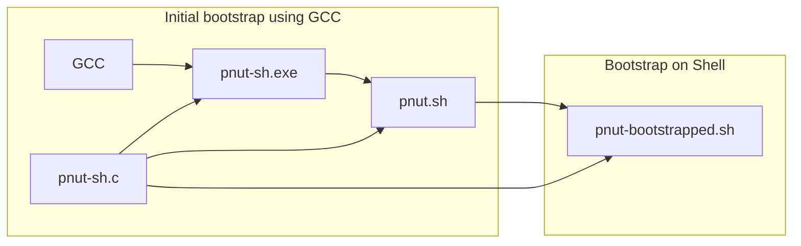
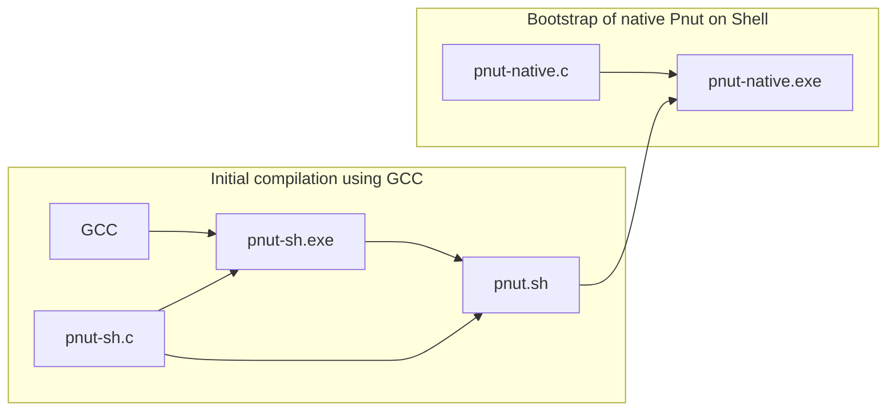

# pnut

A self-compiling C compiler written in C generating human-readable POSIX shell scripts.

Pnut aims to supports a large enough subset of C99 to compile TCC.

## Pnut bootstrap

Pnut can be bootstrapped using an existing C compiler such as GCC. Once the
initial compilation using this compiler is done, the generated shell script can
then



In the spirit of Reflections on Trusting Trust, the generated shell script
closely match the input C file and can be verified by a human. This step is only
required once, as GCC is no longer needed after that step.

Native code backends are also available to remove the dependency on the shell
and to speed up subsequent compilation steps.



## How to use

The `pnut` compiler takes a C file path as input, and outputs to stdout the
POSIX shell code.

Here is a demonstration of self compilation:

```
    $ gcc -Dsh pnut.c -o pnut-sh.exe        # Compile pnut with Shell backend
    $ ./pnut-sh.exe -Dsh pnut.c > pnut.sh   # Generate Pnut shell script
    $ ksh pnut.sh pnut.c -Dsh > pnut2.sh    # Self compile pnut using shell script
    $ ksh pnut2.sh pnut.c -Dsh > pnut3.sh   # One more time
    $ wc pnut.c pnut.sh pnut2.sh pnut3.sh   # Make sure the bootstrapped compilers are equivalent
        2090    6114   45919 pnut.c
        4347   17849  128716 pnut.sh
        4347   17849  128716 pnut2.sh
        4347   17849  128716 pnut3.sh
       15131   59661  432067 total
```

Here is an example of using the bootstrapped compiler:

    $ ksh pnut.sh pi.c > pi.sh
    $ chmod +x pi.sh
    $ ./pi.sh
    31415926535897932384626433832795028841971693993751058209749445923078164062862089986280348253421170679821480865132823066470938446095505822317253594081284811174502841027019385211055596446229489549303819644288109756659334461284756482337867831652712019091456485669234603486104543266482133936072602491412737245870066063155881748815209209628292540917153643678925903600113305305488204665213841469519415116094330572703657595919530921861173819326117931051185480744623799627495673518857527248912279381830119491298336733624406566430860213949463952247371907021798609437027705392171762931767523846748184676694051320005681271452635608277857713427577896091736371787214684409012249534301465495853710507922796892589235420199561121290219608640344181598136297747713099605187072113499999983729780499510597317328160963185
